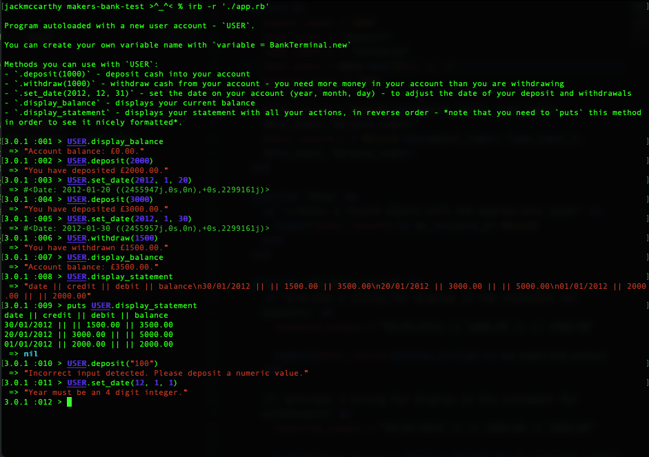

# makers-bank-test
## Makers Academy, Week 10, Tech Test Practice - Bank Tech Test - RUBY

https://github.com/makersacademy/course/tree/master/individual_challenges
https://github.com/makersacademy/course/blob/master/individual_challenges/bank_tech_test.md

## To Use
- git clone the repo to your machine
- run in command line: `bundle install`
- to run tests, enter in command line: `bundle exec rspec`
- to check linter, enter in command line: `rubocop`

**To use Program**
- run irb in your command line: `irb -r './app.rb'`
- this autoloads the file and creates a user account - `USER`
- you can create your own variable name with `variable = BankTerminal.new`

Methods you can use with `USER`:
- `.deposit(1000)` - deposit cash into your account
- `.withdraw(1000)` - withdraw cash from your account - you need more money in your account than you are withdrawing
- `.set_date(2012, 12, 31)` - set the date on your account (year, month, day) - to adjust the date of your deposit and withdrawals
- `.display_balance` - displays your current balance
- `.display_statement` - displays your statement with all your actions, in reverse order - *note that you need to `puts` this method in order to see it nicely formatted*.

## Solution
I developed the solution using TDD. Where I built up the account class, and slowly factored in edge cases and error cases.

I also extracted two additional classes - Record and BankTerminal to perform specific actions as explained below and to SRP the account class.

In developing the BankTerminal class, I realised it would be better to have that class as the interface point for the user. So I refactored the account class into a model layer and added in the user interface actions previously in the account class into the Bank Terminal Class.

I did this to make the code easier to understand with simpler routing, and to structure the code in accordance with SRP, so account was not responsible for processing actions and also displaying ouput to the user.

Following the code self review, I moved the error messaging and error checking out to an error manager module in an effort to make the account and terminal classes smaller and more direct.

Edge cases built:
- Overdrafts not allowed - made this assumption as users should not be allowed to go into debt unknowingly and without agreeing terms.
- Did not allow negative or zero deposits and withdrawals as this would have strange effects on the account and not match with a common understanding of the terms deposit or withdraw.
- Only allowed numeric values e.g. integer and floats to be entered into deposit and withdraw, to make it easier to handle information and not have to make code to handle strange entries.

At the time of submission:
- no rubocop error - except BankTerminal class over 30 lines.
- all tests passed and 100% coverage

**Post Coach Feedback**
Following initial coach review I refactored the code and made changes as outlined in the coach_feedback.md [file](https://github.com/jackmcc08/makers-bank-test/blob/main/coach_feedback.md).

## Code Structure & Dependencies
- Built with Ruby Version: 3.0.1

The code is developed around a MVC type structure, with 3 classes.
  - BankTerminal - acts as the view and controller - routing actions to the model
  - Account - acts as the model - performing the logic on the commands
  - Record - acts as a database table - storing each action

#### Key Gems
- Testing: RSPEC
- Coverage: SimpleCov
- Linting: Rubocop

## Improvement Ideas
If I had more time I would probably implement a sorting by date for the records.

## Concerns
Main concern is that as this is an IRB program, is the user can access all the classes and disrupt the routing of the program. Therefore more error catching development would probably be needed or a command line interface to narrow down the possible user entry errors.
